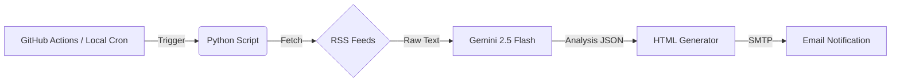

# 📈 Daily Quant Financial Briefing (AI-Powered)

> **基于 Gemini 2.5 Flash 的全自动化量化财经早报系统 (Community Edition)**
>
> An automated financial briefing bot powered by LLMs, Python, and GitHub Actions.


## 📖 项目简介 (Introduction)

本项目是一个运行在 **GitHub Actions** 上的无服务器（Serverless）自动化脚本。它旨在为金融从业者、量化交易员及开发者提供一份**零成本、高质量**的每日财经早报。

**核心工作流：**
1.  **数据摄取**：自动抓取全球主流财经媒体（CNBC, TechCrunch, CoinDesk, Yahoo Finance 等）的 RSS 数据流。
2.  **AI 量化分析**：利用 **Google Gemini 2.5 Flash** 长文本模型阅读新闻，进行宏观趋势总结，并输出 **-10 (极度恐慌) 到 +10 (极度贪婪)** 的市场情绪量化打分。
3.  **智能分发**：生成包含精美 HTML 排版的早报，通过 SMTP 服务自动推送到你的邮箱。

✨ **核心特性：**
* **0 成本运行**：完全利用 GitHub Actions 免费额度 + Gemini 免费 API。
* **极简配置**：抛弃复杂的数据库依赖，仅需修改 `config.json` 即可自定义新闻源和收件人。
* **严谨溯源**：AI 生成的综述强制包含 `[ID]` 引用，点击可直达原始新闻链接，拒绝 AI 幻觉。
* **环境自适应**：自动识别本地运行（Local）与云端运行（Cloud）环境。

## 📸 运行效果 (Demo)


## 🏗️ 架构流程 (Architecture)



## 🚀 快速开始 (Quick Start)

### 1. 克隆仓库

```bash
git clone [https://github.com/Sirius77-AI-cloud/Daily-News-Briefing-OpenSource.git](https://github.com/Sirius77-AI-cloud/Daily-News-Briefing-OpenSource.git)
cd Daily-News-Briefing-OpenSource
pip install -r requirements.txt

```

### 2. 本地配置 (config.json)

项目根目录下已包含 `config.json` 模板。你可以自由添加 RSS 源或修改接收邮箱。

```json
{
  "rss_sources": {
    "CNBC Finance": "[https://search.cnbc.com/rs/search/combinedcms/view.xml?partnerId=wrss01&id=10000664](https://search.cnbc.com/rs/search/combinedcms/view.xml?partnerId=wrss01&id=10000664)",
    "TechCrunch": "[https://techcrunch.com/feed/](https://techcrunch.com/feed/)"
  },
  "receivers": [
    "your_email@example.com"
  ]
}

```

### 3. 设置环境变量 (Secrets)

为了安全起见，API Key 和邮箱密码**绝不能**直接写在代码里。

* **本地运行**：请确保系统环境变量中有以下值，或使用 `.env` 文件加载。
* **GitHub Actions 运行**：请在仓库的 `Settings` -> `Secrets and variables` -> `Actions` 中添加以下 Secrets：

| Secret Name | 描述 | 获取方式 |
| --- | --- | --- |
| `GEMINI_API_KEY` | Google AI Studio Key | [Google AI Studio](https://aistudio.google.com/) |
| `SENDER_EMAIL` | 发件人邮箱 | 建议使用 163 或 Gmail |
| `SENDER_PASSWORD` | SMTP 授权码 | 邮箱设置中开启 POP3/SMTP 获取 (非登录密码) |

### 4. 运行脚本

**本地测试：**

```bash
python main_opensource.py

```

**云端部署：**

1. 将代码 Push 到你的 GitHub 仓库。
2. 确保 `.github/workflows/daily_task.yml` 存在（如未包含，可参考下方配置）。
3. GitHub Actions 会在每天 **北京时间 07:30** 自动运行。

## ⚙️ 常见问题 (FAQ)

**Q: 为什么邮件发送失败？**
A: 请检查 `SENDER_PASSWORD` 是否使用了邮箱的**授权码**（而不是登录密码）。如果是 163 邮箱，可能需要确认是否开启了 SMTP 服务。

**Q: 如何修改运行时间？**
A: 修改 `.github/workflows` 文件夹下 `.yml` 文件中的 `cron` 表达式。例如 `30 23 * * *` 对应北京时间早上 07:30。

**Q: 我想加数据库功能怎么办？**
A: 本仓库为**社区版**，旨在极简部署。如果你有开发能力，可以自行修改代码接入 MySQL 或 Supabase。

## 🤝 贡献 (Contributing)

欢迎提交 Issue 和 Pull Request！
如果你有更好的 Prompt 优化建议，或者发现更优质的财经 RSS 源，请随时分享。

## 📄 License

MIT License.
这意味着你可以免费使用、修改和分发代码，但请保留原作者版权声明。

---

*Created by [Sirius77-AI-cloud*](https://www.google.com/search?q=https://github.com/Sirius77-AI-cloud)
